# Civic Portal — Comprehensive Project & Architecture Report

> **Project Name:** Civic Portal (Smart Local Grievance Redressal & Municipal Complaint Tracking System)  
> **Version:** 1.0.0  
> **Target Deployment:** Vercel (Production) & Localhost (Development)  
> **Backend Service:** Supabase (PostgreSQL, Auth, Storage, Realtime)  
> **Author / Admin Contact:** ayushsharma8635@gmail.com  

---

## Table of Contents

1. [Executive Summary](#1-executive-summary)
2. [Problem Statement & Solution Architecture](#2-problem-statement--solution-architecture)
3. [Complaint Lifecycle & Business Logic](#3-complaint-lifecycle--business-logic)
4. [System Architecture Diagram](#4-system-architecture-diagram)
5. [Frontend Architecture & Technical Details](#5-frontend-architecture--technical-details)
   - 5.1 [Core Stack & Tooling](#51-core-stack--tooling)
   - 5.2 [Design System, Theming & UI Components](#52-design-system-theming--ui-components)
   - 5.3 [Routing & Role-Based Access Control](#53-routing--role-based-access-control)
   - 5.4 [State Management & Data Synchronization](#54-state-management--data-synchronization)
   - 5.5 [Maps & Geolocation Subsystem](#55-maps--geolocation-subsystem)
   - 5.6 [Analytics & Data Visualizations](#56-analytics--data-visualizations)
   - 5.7 [Client-Side Document & Receipt Generation](#57-client-side-document--receipt-generation)
6. [Backend Architecture & Database Details](#6-backend-architecture--database-details)
   - 6.1 [Supabase Architecture Overview](#61-supabase-architecture-overview)
   - 6.2 [Relational Database Schema & Entities](#62-relational-database-schema--entities)
   - 6.3 [Row-Level Security (RLS) & Security Functions](#63-row-level-security-rls--security-functions)
   - 6.4 [Realtime CDC (Change Data Capture) Publication](#64-realtime-cdc-change-data-capture-publication)
   - 6.5 [Cloud Storage Bucket Configuration](#65-cloud-storage-bucket-configuration)
   - 6.6 [Resilient LocalStorage Fallback & Offline Demo Mode](#66-resilient-localstorage-fallback--offline-demo-mode)
7. [User Roles, Authentication & Permissions](#7-user-roles-authentication--permissions)
   - 7.1 [Citizen Flow](#71-citizen-flow)
   - 7.2 [Field Officer Flow](#72-field-officer-flow)
   - 7.3 [Strict Single-Admin Architecture](#73-strict-single-admin-architecture)
8. [Smart Heuristics & Complaint Analysis Engine](#8-smart-heuristics--complaint-analysis-engine)
9. [Project Directory & File Structure](#9-project-directory--file-structure)
10. [Environment Configuration & Deployment Pipeline](#10-environment-configuration--deployment-pipeline)
11. [Conclusion & Future Roadmap](#11-conclusion--future-roadmap)

---

## 1. Executive Summary

The **Civic Portal** is a modern, enterprise-grade, cloud-native web application designed to modernize municipal grievance handling and local civic issue tracking. Built to serve cities like Kanpur, India, the application bridges the gap between citizens, municipal field officers, and administrative heads.

Citizens frequently encounter civic infrastructure issues such as potholes, overflowing sewers, non-functioning street lights, and irregular garbage collection. In conventional administrative setups, filing a grievance requires physical visits to ward offices, lengthy paperwork, and a complete absence of status visibility. 

Civic Portal transforms this process into a transparent, digital-first experience:
- Citizens report issues in seconds with **GPS location tagging**, **photo evidence**, and **automated department categorization**.
- Municipal departments and assigned field officers receive real-time task allocations with SLA expectations.
- Field officers document repair progress directly from the field with multi-phase image uploads (Before, During, and After repair).
- Municipal administrators monitor macro-level civic metrics, delayed resolutions, and departmental performance through an interactive dashboard.

---

## 2. Problem Statement & Solution Architecture

### Traditional Bottlenecks
1. **Lack of Geolocation Tracking:** Citizens struggle to describe issue locations precisely, leading to field workers failing to locate problems.
2. **Ambiguous Ownership:** Complaints bounce across departments (e.g., PWD vs. Jal Sansthan) due to miscategorization.
3. **No Resolution Accountability (SLAs):** Citizens have no estimate of when an issue will be resolved, nor can they hold departments accountable for delays.
4. **Absence of Proof of Work:** Issues are marked "Resolved" without verifiable proof or citizen sign-off.
5. **Information Silos:** Ward officers work without consolidated analytics, making proactive resource allocation impossible.

### Civic Portal Solution
| Bottleneck | Civic Portal Implementation |
| :--- | :--- |
| Location Ambiguity | Interactive Google Maps / OpenStreetMap pin drop, ward-level geofencing, and browser GPS reverse-geocoding. |
| Department Routing | Heuristic AI Triage engine that automatically analyzes complaint title and description to route issues to the correct department (PWD, Jal Sansthan, KESCO, Nagar Nigam). |
| SLA Accountability | Dynamic SLA computation per category (e.g., Garbage = 1 day, PWD = 5 days) with automated `is_delayed` detection and visual delay badges. |
| Proof of Work | Multi-phase evidence management requiring field officers to upload visual evidence tagged by phase (`before`, `during`, `after`). |
| System Visibility | Real-time Supabase CDC websocket feeds updating citizen dashboards, officer queues, and admin charts without page refreshes. |

---

## 3. Complaint Lifecycle & Business Logic

A civic grievance in Civic Portal transitions through a well-defined state machine with audit trails and citizen notifications at every step:

```
[Citizen Submission]
       │ (Auto-generated Code: e.g. CP20261042)
       ▼
   [Pending] ──────► [AI Triage: Department & Priority Assigned]
       │
       ├─────────────────────────────────┐
       ▼                                 ▼
  [In Review]                       [Rejected] (Spam/Duplicate)
       │
       ▼
  [Assigned] ──────► Assigned to Area Field Officer & Department
       │
       ▼
  [Accepted] (Officer acknowledges grievance)
       │
       ▼
 [Work Started] ────► Officer uploads "Before" photo evidence
       │
       ▼
  [In Progress] ────► Work in progress; temporary relief broadcasted
       │
       ▼
[Work Completed] ───► Officer uploads "After" photo evidence
       │
       ▼
   [Resolved] ──────► SLA finalized, citizen notified, PDF receipt available,
                      citizen submits 1-5 Star rating & feedback.
```

### Temporary Solutions & Civic Relief
For severe infrastructural failures (e.g., deep road cave-ins or main waterline bursts), repair works often take several days. Civic Portal allows administrators and officers to publish **temporary solutions** directly to the public complaint card, including:
- **Alternative traffic routes**
- **Emergency drinking water tanker availability & timings**
- **Temporary local contact person & telephone number**

---

## 4. System Architecture Diagram

```mermaid
flowchart TB
    subgraph ClientLayer ["Client Layer (Browser / SPA)"]
        A[Citizen Device / Web Browser]
        B[Field Officer Mobile / Web]
        C[Administrator Portal]
    end

    subgraph PresentationLayer ["Frontend (React 18 + Vite)"]
        D[React Router DOM v6 - Protected & Role-Based Routes]
        E[AuthContext - Supabase Auth & Session Hydration]
        F[TanStack React Query - Cache & Optimistic UI]
        G[Tailwind CSS + Shadcn/ui Design Tokens]
        H[Google Maps API & Leaflet Integration]
        I[Recharts Data Analytics Engine]
        J[jsPDF Receipt Generator]
    end

    subgraph APILayer ["API & Business Logic Layer (src/api/supabaseClient.js)"]
        K[Unified Entity Repository Factory]
        L[Realtime WebSocket Subscriptions]
        M[Edge Function / Mock Invocations: analyzeComplaint, officerPortal]
        N[Client-Side File Uploader: Supabase Storage / DataURL Fallback]
        O[Resilient LocalStorage Fallback Store]
    end

    subgraph BackendLayer ["Backend as a Service (Supabase)"]
        P[Supabase Auth - PKCE OAuth & Email/Password]
        Q[(PostgreSQL 15 Database)]
        R[Supabase Storage - Bucket: complaint-media]
        S[Realtime Server - Postgres WAL Publication]
    end

    subgraph DatabaseEntities ["PostgreSQL Tables & Triggers"]
        T[profiles]
        U[departments]
        V[areas]
        W[officers]
        X[complaints]
        Y[complaint_media]
        Z[notifications]
        AA[officer_activity_logs]
        AB[feedback]
        AC[Triggers: trg_enforce_admin_role, on_auth_user_created]
    end

    ClientLayer --> PresentationLayer
    PresentationLayer --> APILayer
    APILayer --> BackendLayer
    BackendLayer --> DatabaseEntities
```



---

## 5. Frontend Architecture & Technical Details

### 5.1 Core Stack & Tooling
- **Library:** React 18.2.0 (Functional Components, Hooks, Context API)
- **Build Tool:** Vite 6.1.0 (Lightning-fast HMR, ES module bundling, tree-shaking)
- **Language:** JavaScript (ESNext) with JSDoc typing and `jsconfig.json` path alias `@/*` -> `./src/*`
- **Linter & Code Standards:** ESLint 9 (Flat config with `eslint-plugin-react`, `eslint-plugin-react-hooks`)

### 5.2 Design System, Theming & UI Components
The application features a bespoke civic palette tailored with warm earthy greens and civic tones:
- **Design Philosophy:** Clean, institutional yet welcoming civic aesthetics with rounded borders (`var(--radius): 0.875rem`), accessible contrast ratios, and glassmorphic touches.
- **Color Variables (HSL):**
  - Light Background: `hsl(43, 33%, 96%)`
  - Dark Background: `hsl(30, 10%, 12%)`
  - Primary Civic Green: `hsl(139, 15%, 42%)` (Light) / `hsl(139, 20%, 55%)` (Dark)
  - Card & Popover: Pure white / subtle dark slate
- **Typography:**
  - Headings & Display: `Nunito Sans` (weight 600 to 900)
  - Body & UI: `Inter` (weight 400 to 700)
  - Monospace: UI Monospace for complaint codes and coordinates
- **Component Primitives (Radix UI & Shadcn UI):**
  - Fully accessible dialogs, alert dialogs, dropdown menus, selects, tabs, popovers, collapsibles, scroll areas, and tooltips.
- **Icons & Visuals:** `lucide-react` (comprehensive iconography), `canvas-confetti` (for celebratory submission feedback).

### 5.3 Routing & Role-Based Access Control
Routes are defined declaratively in [src/App.jsx](file:///c:/Users/ayush/OneDrive/Documents/Official%20Project/src/App.jsx):

```
/ (Public / Citizen Dashboard)
├── /login (Multi-role login: Citizen, Officer, Admin)
├── /register (Citizen self-registration)
├── /forgot-password & /reset-password (Password recovery)
│
├── [Citizen Protected Routes - ProtectedRoute]
│   ├── /citizen/dashboard (Citizen complaint summary & metrics)
│   ├── /submit (Submit complaint form with location & photo evidence)
│   ├── /track (Live tracking, timeline, feedback & PDF receipt)
│   ├── /history (Personal complaint filing log)
│   └── /profile (Citizen user details and phone updates)
│
├── [Strict Single-Admin Protected Routes - AdminProtectedRoute]
│   ├── /admin/dashboard (Macro analytics, department performance, SLA monitoring)
│   ├── /admin/complaints (Triage, reassignment, status changes, temporary solutions)
│   ├── /admin/areas (Kanpur municipal wards and boundary management)
│   ├── /admin/officers (Field officer user provisioning and assignment)
│   └── /admin/map (Geospatial heatmap / cluster pin view of city complaints)
│
└── [Officer Protected Routes - OfficerProtectedRoute]
    ├── /officer/complaints (Assigned complaint work queue with filters)
    └── /officer/complaints/:id (Issue inspection, phase evidence upload, status updates)
```

### 5.4 State Management & Data Synchronization
1. **Authentication Context (`AuthContext.jsx`):**
   - Automatically initializes Supabase session from URL tokens or stored local tokens.
   - Cleans OAuth callback queries (`?code=`, `?state=`) from window history upon verification.
   - Computes dynamic user profiles and ensures strict single-admin assignment against `VITE_ADMIN_EMAIL`.
2. **Server State (`@tanstack/react-query`):**
   - Provides caching, query invalidation, and data hydration.
3. **Realtime Live Updates:**
   - Supabase WebSocket channels subscribe to `postgres_changes` across tables.
   - The UI automatically reloads datasets and displays non-blocking toast notifications (e.g., *"Live update: New complaint CP20261042 received"*).

### 5.5 Maps & Geolocation Subsystem
- **Google Maps Integration (`useGoogleMaps.js`, `ComplaintMap.jsx`):**
  - Dynamically injects the Google Maps JavaScript SDK using the API key defined in `VITE_GOOGLE_MAPS_API_KEY`.
  - Configures a bounding box centered on Kanpur (`lat: 26.4499, lng: 80.3319`).
  - Supports click-to-place draggable marker coordinates.
  - Generates custom SVG map pins color-coded by complaint priority (Red for High, Blue for Medium, Gray for Low).
- **Browser GPS Integration (`LocationPicker.jsx`):**
  - `navigator.geolocation.getCurrentPosition` queries high-accuracy mobile/desktop coordinates.
  - Matches coordinates to the nearest active municipal ward.

### 5.6 Analytics & Data Visualizations
The Admin and Citizen dashboards leverage **Recharts** to present live metrics:
- **Area Chart:** Monthly trend of submitted vs. resolved complaints across a rolling 6-month window.
- **Pie / Donut Chart:** Categorical distribution of complaints (Roads, Water, Lighting, Drainage, Sanitation, etc.).
- **Bar Chart:** Departmental resolution rates (% of assigned complaints closed vs. delayed).
- **Stat Cards:** Total complaints, Pending, In Progress, Resolved, Delayed (SLA breached), and Spam/Rejected.

### 5.7 Client-Side Document & Receipt Generation
In [src/lib/pdfReceipt.js](file:///c:/Users/ayush/OneDrive/Documents/Official%20Project/src/lib/pdfReceipt.js), the application generates an official, print-ready PDF complaint receipt using `jsPDF`:
- Standard A4 format with municipal dark-blue header band.
- Unique tracking code, submission timestamp, citizen name, and department details.
- Real-time status indicator (green badge for Resolved, amber for In Progress, red for Delayed).
- Expected resolution date and temporary relief instructions (if any).

---

## 6. Backend Architecture & Database Details

### 6.1 Supabase Architecture Overview
The backend leverages **Supabase**, an open-source Firebase alternative built entirely on enterprise **PostgreSQL 15**:
- **GoTrue Auth:** Handles email/password signups, password resets, and Google OAuth 2.0 PKCE authentication.
- **PostgREST:** Exposes RESTful CRUD endpoints directly over database tables with zero boilerplate.
- **Realtime (Realtime Engine):** Listens to PostgreSQL Write-Ahead Logs (WAL) and broadcasts database mutations to connected clients over WebSockets.
- **Storage:** Object storage for complaint evidence photographs.

### 6.2 Relational Database Schema & Entities

The complete database schema is codified in [supabase/schema.sql](file:///c:/Users/ayush/OneDrive/Documents/Official%20Project/supabase/schema.sql).

#### 1. `profiles`
Links directly to Supabase Auth (`auth.users.id`).
- `id` (UUID, Primary Key, Foreign Key -> `auth.users.id` ON DELETE CASCADE)
- `email` (TEXT)
- `full_name` (TEXT)
- `role` (TEXT, CHECK: `'citizen'`, `'officer'`, `'admin'`)
- `avatar_url` (TEXT)
- `phone` (TEXT)
- `created_at` / `updated_at` (TIMESTAMPTZ)

#### 2. `departments`
Municipal departments responsible for resolving grievances.
- `id` (UUID, Primary Key)
- `name` (TEXT UNIQUE) — *e.g., Public Works Department (PWD), Jal Sansthan, KESCO, Nagar Nigam*
- `description` (TEXT)
- `head` (TEXT)
- `email` / `phone` (TEXT)
- `created_date` (TIMESTAMPTZ)

#### 3. `areas`
Municipal administrative localities and wards.
- `id` (UUID, Primary Key)
- `name` (TEXT UNIQUE) — *e.g., Kalyanpur, Kakadeo, Civil Lines, Swaroop Nagar, Govind Nagar, Kidwai Nagar*
- `city` (TEXT, default: 'Kanpur')
- `ward` (TEXT)
- `district` (TEXT, default: 'Kanpur Nagar')
- `latitude` / `longitude` (DOUBLE PRECISION)
- `active` (BOOLEAN)
- `created_date` (TIMESTAMPTZ)

#### 4. `officers`
Field officers assigned to specific areas and departments.
- `id` (UUID, Primary Key)
- `name` (TEXT)
- `employee_id` (TEXT UNIQUE)
- `email` / `mobile` (TEXT)
- `username` (TEXT UNIQUE)
- `password_hash` (TEXT)
- `department` (TEXT)
- `area_name` (TEXT)
- `area_id` (UUID, Foreign Key -> `areas.id`)
- `designation` (TEXT)
- `status` (TEXT, CHECK: `'Active'`, `'Inactive'`, `'On Leave'`)
- `created_date` (TIMESTAMPTZ)

#### 5. `complaints`
The central operational table representing a citizen grievance.
- `id` (UUID, Primary Key, default `gen_random_uuid()`)
- `complaint_code` (TEXT) — *Human-readable tracking ID, e.g., CP20264821*
- `title` (TEXT NOT NULL)
- `description` (TEXT)
- `category` (TEXT)
- `department` (TEXT)
- `area_name` (TEXT)
- `area_id` (UUID, Foreign Key -> `areas.id`)
- `landmark` / `address` (TEXT)
- `latitude` / `longitude` (DOUBLE PRECISION)
- `priority` (TEXT, CHECK: `'Low'`, `'Medium'`, `'High'`, `'Urgent'`)
- `status` (TEXT, CHECK: `'Submitted'`, `'Pending'`, `'In Review'`, `'In Progress'`, `'Assigned'`, `'Resolved'`, `'Rejected'`)
- `is_spam` (BOOLEAN, default `false`)
- `duplicate_of` (TEXT)
- `ai_summary` (TEXT)
- `remarks` (TEXT)
- `officer_id` (UUID, Foreign Key -> `officers.id`)
- `officer_name` (TEXT)
- `created_by_id` (UUID)
- `citizen_name` / `citizen_email` / `citizen_phone` (TEXT)
- `estimated_days` (INTEGER)
- `expected_date` (TIMESTAMPTZ)
- `is_delayed` (BOOLEAN, default `false`)
- `temporary_solution` / `temp_alt_route` / `temp_alt_facility` / `temp_availability_time` / `temp_contact` (TEXT)
- `timeline` (JSONB, default `'[]'::jsonb`)
- `actual_resolved_date` (TIMESTAMPTZ)
- `created_date` / `updated_at` (TIMESTAMPTZ)

#### 6. `complaint_media`
Photographic evidence attached to grievances.
- `id` (UUID, Primary Key)
- `complaint_id` (UUID, Foreign Key -> `complaints.id` ON DELETE CASCADE)
- `phase` (TEXT, CHECK: `'before'`, `'during'`, `'after'`)
- `file_url` (TEXT NOT NULL)
- `file_name` (TEXT)
- `media_type` (TEXT, `'photo'` / `'video'`)
- `uploaded_by` (TEXT)
- `created_date` (TIMESTAMPTZ)

#### 7. `notifications`
Citizen alerts for progress updates.
- `id` (UUID, Primary Key)
- `title` / `message` (TEXT NOT NULL)
- `type` (TEXT, default: `'status_update'`)
- `complaint_id` (UUID, Foreign Key -> `complaints.id` ON DELETE CASCADE)
- `user_id` (UUID)
- `read` (BOOLEAN, default `false`)
- `created_date` (TIMESTAMPTZ)

#### 8. `officer_activity_logs` & `activity_logs`
Immutable audit log tracking all actions taken by officers and administrators.
- `id` (UUID, Primary Key)
- `officer_id` (UUID, Foreign Key -> `officers.id`)
- `complaint_id` (UUID, Foreign Key -> `complaints.id` ON DELETE CASCADE)
- `action` / `old_status` / `new_status` / `remarks` (TEXT)
- `created_date` (TIMESTAMPTZ)

#### 9. `feedback`
Citizen ratings upon complaint resolution.
- `id` (UUID, Primary Key)
- `complaint_id` (UUID, Foreign Key -> `complaints.id` ON DELETE CASCADE)
- `user_id` (UUID)
- `rating` (INTEGER, CHECK: 1 to 5)
- `comments` (TEXT)
- `created_date` (TIMESTAMPTZ)

---

### 6.3 Row-Level Security (RLS) & Security Functions

To protect sensitive data while maintaining ease of municipal reporting, PostgreSQL Row Level Security (RLS) is enabled across all tables:

1. **Strict Admin Verification Function:**
   ```sql
   CREATE OR REPLACE FUNCTION public.is_admin()
   RETURNS BOOLEAN AS $$
   BEGIN
     RETURN LOWER(TRIM(COALESCE(auth.jwt() ->> 'email', ''))) = 'ayushsharma8635@gmail.com';
   END;
   $$ LANGUAGE plpgsql SECURITY DEFINER;
   ```
2. **Database-Level Role Guard Trigger:**
   A trigger (`trg_enforce_admin_role`) executes before any `INSERT` or `UPDATE` on `profiles`. If any user attempts to assign themselves the `admin` role and their email does not match `ayushsharma8635@gmail.com`, the role is automatically reset to `citizen`.
3. **Complaints & Media Access:**
   - `SELECT`: Viewable by all authenticated and anonymous citizens (for transparency and public tracking).
   - `INSERT`: Open to all authenticated citizens.
   - `UPDATE`: Open to authorized officers and administrators.
   - `DELETE`: Strictly restricted via `USING (public.is_admin())`. Only the designated super-admin can delete a complaint.

---

### 6.4 Realtime CDC (Change Data Capture) Publication

To enable instantaneous live updates without manual page refreshes:
```sql
ALTER TABLE public.complaints REPLICA IDENTITY FULL;
ALTER TABLE public.complaint_media REPLICA IDENTITY FULL;
ALTER TABLE public.notifications REPLICA IDENTITY FULL;
ALTER TABLE public.officer_activity_logs REPLICA IDENTITY FULL;

ALTER PUBLICATION supabase_realtime ADD TABLE public.complaints;
ALTER PUBLICATION supabase_realtime ADD TABLE public.complaint_media;
ALTER PUBLICATION supabase_realtime ADD TABLE public.notifications;
ALTER PUBLICATION supabase_realtime ADD TABLE public.officer_activity_logs;
```

---

### 6.5 Cloud Storage Bucket Configuration

A Supabase Storage bucket named `complaint-media` is configured with public read access:
- File paths: `uploads/{timestamp}_{randomId}.{ext}`
- Direct public URLs are stored in `complaint_media.file_url`.
- RLS policies permit authenticated and anonymous uploads.

---

### 6.6 Resilient LocalStorage Fallback & Offline Demo Mode

A critical architectural feature of Civic Portal is its **zero-crash fallback design**:
- In [src/api/supabaseClient.js](file:///c:/Users/ayush/OneDrive/Documents/Official%20Project/src/api/supabaseClient.js), `hasValidSupabaseConfig` verifies whether valid Supabase environment variables exist.
- If credentials are not yet supplied (or when running offline), the repository factory automatically mirrors all CRUD and filter operations against browser `localStorage` prefixed with `scms_demo_`.
- File uploads that fail against cloud storage automatically fallback to client-side `FileReader.readAsDataURL` encoding, ensuring seamless offline demonstrations without breaking UI flows.

---

## 7. User Roles, Authentication & Permissions

Civic Portal defines three explicit user roles:

```
┌─────────────────────────────────────────────────────────────┐
│                       USER ROLES                            │
├───────────────────┬─────────────────────┬───────────────────┤
│   1. CITIZEN      │  2. FIELD OFFICER   │     3. ADMIN      │
├───────────────────┼─────────────────────┼───────────────────┤
│ • File grievances │ • Assigned to areas │ • Single Superuser│
│ • GPS pin drop    │ • Inspect issues    │ • Triage & assign │
│ • Upload evidence │ • Upload progress   │ • City analytics  │
│ • Track timeline  │   photos (Before/   │ • Manage officers │
│ • Download PDF    │   During/After)     │ • Manage wards    │
│ • Rate resolution │ • Change status     │ • Delete records  │
└───────────────────┴─────────────────────┴───────────────────┘
```

### 7.1 Citizen Flow
- Can sign up with email/password or one-click Google OAuth.
- Authenticated state stored via Supabase GoTrue Auth token.
- Has access to the main dashboard, file complaint form, track complaint page, and history log.

### 7.2 Field Officer Flow
- Municipal officers are provisioned by the Administrator (assigned to a specific Department and Ward).
- Officer credentials are authenticated through the dedicated officer portal (`/officer-login` / `api.functions.invoke('officerLogin')`).
- Session is maintained via `civic_officer_session` and guarded by `OfficerProtectedRoute`.
- Officer can only modify complaints within their jurisdiction and cannot access system-level administrative configurations.

### 7.3 Strict Single-Admin Architecture
- To prevent privilege escalation, administrative privileges are locked to a single designated administrator: **`ayushsharma8635@gmail.com`**.
- This constraint is validated at three independent layers:
  1. **Client-side routing:** `AdminProtectedRoute.jsx` checks `user?.role === 'admin'`.
  2. **API layer:** `isAuthorizedAdminEmail(email)` verifies against environment variable `VITE_ADMIN_EMAIL`.
  3. **Database trigger:** PostgreSQL trigger `trg_enforce_admin_role` blocks unauthorized role updates.

---

## 8. Smart Heuristics & Complaint Analysis Engine

The frontend integrates an intelligent analysis routine ([src/api/supabaseClient.js](file:///c:/Users/ayush/OneDrive/Documents/Official%20Project/src/api/supabaseClient.js#L905-L946)) that triggers when a citizen fills out their complaint:

```javascript
api.functions.invoke("analyzeComplaint", { title, description, category })
```

### Analysis Heuristics:
1. **Department Auto-Routing:**
   - Keywords like `water`, `drain`, `sewer`, `pipe`, `overflow`, `leak` ➔ **Jal Sansthan (Water & Drainage)**
   - Keywords like `light`, `electric`, `wire`, `transformer`, `spark` ➔ **KESCO (Electricity & Street Lighting)**
   - Keywords like `garbage`, `waste`, `dustbin`, `dump`, `filth` ➔ **Solid Waste & Sanitation (Nagar Nigam)**
   - Keywords like `dog`, `animal`, `mosquito`, `dengue`, `smell` ➔ **Health & Vector Control**
   - Keywords like `parking`, `traffic`, `jam`, `encroach` ➔ **Traffic & Public Safety**
   - Keywords like `pothole`, `road`, `cracked`, `sidewalk` ➔ **Public Works Department (PWD)**
2. **Priority Estimation:**
   - Urgent danger terms (e.g., `spark`, `hanging wire`, `burst pipe`, `deep cave-in`, `accident`) escalate priority to **High** or **Urgent**.
3. **Spam & Garbage Detection:**
   - Submissions under 8 characters or containing gibberish patterns (`asdf`, `qwerty`, `1234`) are flagged with `is_spam = true`.
4. **Resolution SLA Estimation:**
   - Dynamic SLA deadlines computed per category (e.g., Garbage = 1 day, Pothole = 5 days, Street Light = 2 days).

---

## 9. Project Directory & File Structure

```
c:\Users\ayush\OneDrive\Documents\Official Project\
├── index.html                   # HTML entry point with meta viewport & favicon
├── package.json                 # Dependency manifests & run scripts
├── vite.config.js               # Vite build configuration & path aliases
├── tailwind.config.js           # Custom civic theme tokens & Radix animations
├── postcss.config.js            # Tailwind & Autoprefixer plugin config
├── vercel.json                  # Vercel SPA rewrite & security headers
├── .env.example                 # Template for required environment variables
├── .env.local                   # Local environment variable overrides
├── AGENTS.md                    # Agentic developer instructions & project rules
├── README.md                    # Setup and onboarding guide
│
├── supabase/
│   └── schema.sql               # PostgreSQL tables, triggers, RLS & seed data
│
└── src/
    ├── main.jsx                 # Application entry point mounting React root
    ├── App.jsx                  # Master router & route protection hierarchy
    ├── index.css                # CSS variables, HSL color tokens & font imports
    │
    ├── api/
    │   └── supabaseClient.js    # Supabase client, entity repositories, auth layer,
    │                            # functions, storage uploader, mock data fallback
    │
    ├── components/              # Shared reusable UI components
    │   ├── Layout.jsx           # Main application shell with navbar & sidebar
    │   ├── Sidebar.jsx          # Collapsible responsive sidebar navigation
    │   ├── OfficerLayout.jsx    # Field officer portal layout shell
    │   ├── ProtectedRoute.jsx   # Citizen auth route guard
    │   ├── AdminProtectedRoute.jsx # Admin role route guard
    │   ├── OfficerProtectedRoute.jsx # Officer session route guard
    │   ├── LocationPicker.jsx   # GPS & ward-based locality selector
    │   ├── ComplaintMap.jsx     # Google Maps / marker visualization
    │   ├── EvidenceCapture.jsx  # Multi-file photo evidence uploader
    │   ├── NotificationBell.jsx # Real-time notification drawer
    │   ├── StatCard.jsx         # Metric KPI card component
    │   ├── StatusBadge.jsx      # Colored status & delay pill badges
    │   ├── ThemeToggle.jsx      # Light / dark theme switcher
    │   ├── ToastContainer.jsx   # React-hot-toast / Sonner notification provider
    │   ├── login/               # Tabbed multi-role login sub-components
    │   │   ├── AdminLoginForm.jsx
    │   │   ├── CitizenLoginForm.jsx
    │   │   ├── OfficerLoginForm.jsx
    │   │   └── RoleSelection.jsx
    │   └── ui/                  # 30+ Radix UI / Shadcn accessible components
    │
    ├── hooks/
    │   ├── useGoogleMaps.js     # Asynchronous Google Maps script loader
    │   ├── use-mobile.jsx       # Viewport breakpoint detection hook
    │   └── use-size.jsx         # DOM bounding rectangle measurement hook
    │
    ├── lib/
    │   ├── AuthContext.jsx      # Master authentication & session state context
    │   ├── pdfReceipt.js        # jsPDF complaint receipt generation
    │   ├── resolutionConfig.js  # Category SLAs and delay calculation helpers
    │   ├── officerSession.js    # Field officer session persistence helpers
    │   ├── query-client.js      # TanStack Query client instance
    │   ├── toast.js             # Unified notification trigger helper
    │   └── utils.js             # Tailwind class merging utility (clsx + twMerge)
    │
    └── pages/                   # Page-level route views
        ├── Home.jsx             # Citizen dashboard & quick actions
        ├── SubmitComplaint.jsx  # Complaint submission form
        ├── ComplaintTracking.jsx# Live complaint status, feedback & PDF download
        ├── ComplaintHistory.jsx # List of citizen's previously filed grievances
        ├── Profile.jsx          # Citizen profile settings & account details
        ├── Login.jsx            # Unified login portal
        ├── Register.jsx         # Citizen registration & OTP verification
        ├── ForgotPassword.jsx   # Password reset request
        ├── ResetPassword.jsx    # New password submission
        ├── AdminDashboard.jsx   # Admin macro-analytics & performance graphs
        ├── AdminComplaints.jsx  # Admin grievance triage & reassignment
        ├── AdminAreas.jsx       # Municipal ward & landmark management
        ├── AdminOfficers.jsx    # Officer roster & credentials management
        ├── ComplaintMapPage.jsx # Full-screen city grievance map
        ├── OfficerComplaints.jsx# Field officer assigned complaint queue
        └── OfficerComplaintDetail.jsx # Officer grievance inspection & photo upload
```

---

## 10. Environment Configuration & Deployment Pipeline

### Required Environment Variables

| Variable | Required | Description |
| :--- | :---: | :--- |
| `VITE_SUPABASE_URL` | **Yes** | Your Supabase project API URL (e.g. `https://xyz.supabase.co`) |
| `VITE_SUPABASE_ANON_KEY` | **Yes** | Your Supabase anon / public API key |
| `VITE_ADMIN_EMAIL` | **Yes** | Designated single-admin email (`ayushsharma8635@gmail.com`) |
| `VITE_GOOGLE_MAPS_API_KEY` | Optional | Google Maps JavaScript API key for interactive map & location picking |
| `VITE_GOOGLE_CLIENT_ID` | Optional | Google OAuth client ID for web authentication |

### Production Deployment to Vercel
The project is optimized for deployment on Vercel:
- `vercel.json` provides:
  - Single Page Application (SPA) catch-all rewrite (`/(.*) -> /index.html`).
  - Strict security headers (`X-Frame-Options: SAMEORIGIN`, `X-Content-Type-Options: nosniff`, `X-XSS-Protection: 1; mode=block`).
  - Static asset cache headers (`Cache-Control: public, max-age=31536000, immutable`).

---

## 11. Conclusion & Future Roadmap

Civic Portal delivers a scalable, modern, and transparent solution for municipal grievance management. By pairing React 18 and Vite on the frontend with PostgreSQL, GoTrue Auth, and Realtime on Supabase, the system ensures real-time operational efficiency for citizens, field officers, and administrators alike.

### Future Roadmap Enhancements:
1. **Automated WhatsApp / SMS Gateway:** Direct notifications via Twilio or Gupshup for citizens without smartphones.
2. **Computer Vision for Pothole Detection:** Automatic severity grading of road damage from citizen photos using a lightweight TensorFlow.js model.
3. **Multi-lingual Support (i18n):** Native Hindi and regional language support for broader civic accessibility.
4. **Geofenced Push Notifications:** Alerting citizens in specific wards when scheduled water cuts or road repair works take place.
